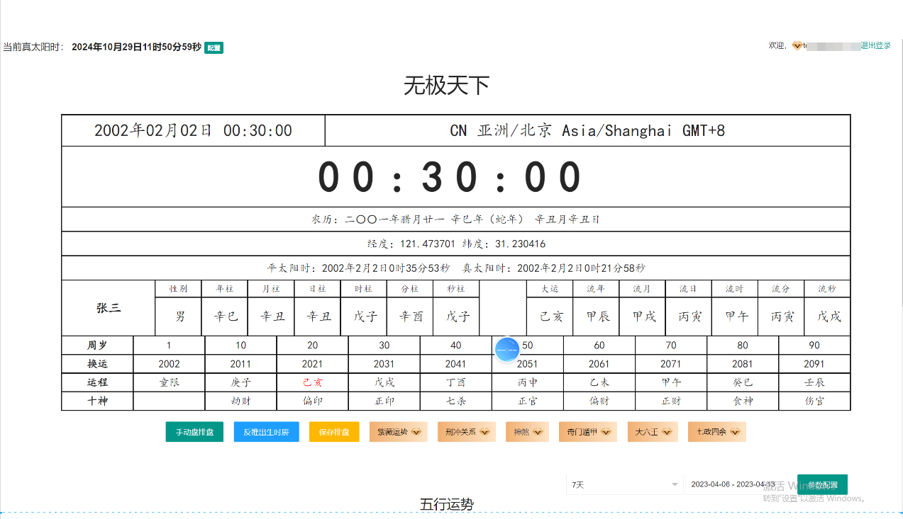
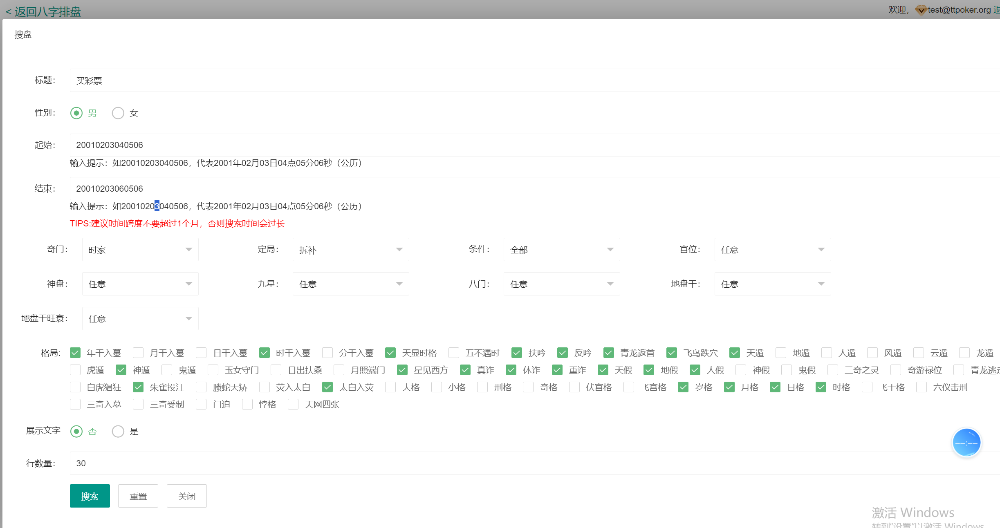
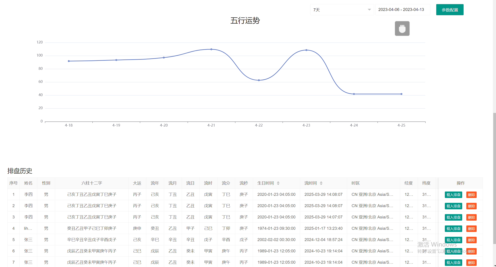
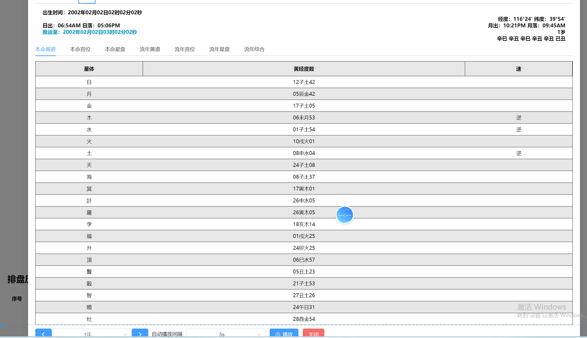
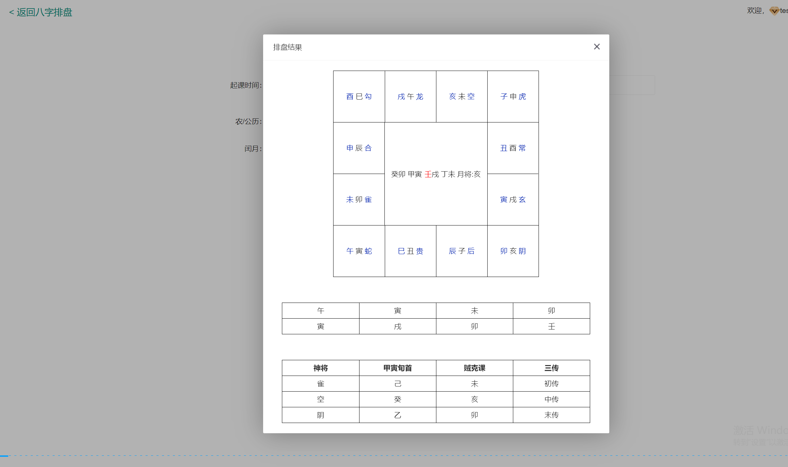

# 🧮 周易玄学集大成者 | 八字+紫微+七政四余+奇门+六壬 完整排盘系统
> **数十年周易研究 | 集七种核心玄学算法于一体 | 网页实时排盘 | 可商业运营**
🔥 Chinese Fortune Telling Platform | 命理系统 | 命理系統
👉 Bazi + Ziwei + Qimen Dunjia | API Ready | SaaS Ready | Commercial Use🔥 Chinese Metaphysics Platform | Bazi + Ziwei + Qimen Dunjia + Liu Ren
👉 Fortune Telling System | Astrology Engine | Divination Platform | Ready for Commercial Use

---

## ✨ 核心特色 | Unique Advantages..

本项目是市面上罕见的**集大成者**，将七种核心玄学算法融合在一个系统中：

| 模块 | 功能说明 |
| :--- | :--- |
| 📅 **四柱八字** | 阴阳五行、干支、排盘、运势推算 |
| 🌟 **紫微斗数** | 紫薇运势、星曜排盘、神煞分析 |
| 🧭 **奇门遁甲** | 排盘、格局分析、吉凶判断 |
| ⭐ **七政四余** | 古天文历法、星曜运行推演 |
| 🌀 **大六壬** | 六壬神课、占卜断事 |
| ⚖️ **刑冲关系** | 地支刑冲合害、神煞解析 |

## 🎯 功能清单 | Feature List
 八字排盘 ✅ 紫微斗数排盘 ✅ 奇门遁甲排盘
✅ 七政四余排盘 ✅ 大六壬占卜 ✅ 神煞查询
✅ 刑冲关系分析 ✅ 运势推算 ✅ 网页实时展示

## 🚀 技术架构 | Tech Stack

- **后端**：Java (Spring生态)
- **前端**：HTML/JS (可部署网页)
- **部署**：支持Web直接访问，可打包App

## 📁 代码结构

├── UserService.java # 用户服务
├── PanRecordService.java # 排盘记录
├── MoiraTaskService.java # 占卜任务
├── WuXingConfigService.java # 五行配置
├── SmsRecordService.java # 短信记录
└── UserOrderService.java # 订单管理

🔥 Chinese Metaphysics Platform | 命理计算平台 | 命理計算平台 | Bazi + Ziwei + Qimen Dunjia
## 🧠 项目定位 / 專案定位 / What is this?

本项目是一套完整的中国传统命理计算系统，包含：  
本專案是一套完整的中國傳統命理計算系統，包含：  
This project is a complete Chinese metaphysics calculation system, including:

- 八字（四柱） / 八字（四柱） / Bazi (Four Pillars)  
- 紫微斗数 / 紫微斗數 / Ziwei Doushu  
- 奇门遁甲 / 奇門遁甲 / Qimen Dunjia  
- 六壬 / 六壬 / Liu Ren  

可用于：  
可用於：  
It can be used for:

- 命理预测平台 / 命理預測平台 / Fortune telling platform  
- 占星/玄学系统 / 占星/玄學系統 / Astrology system  
- AI预测工具 / AI預測工具 / AI prediction tools  
## 🏆 使用场景 / 使用場景 / Use Cases

- 命理网站 / 命理網站 / Fortune telling website  
- 命理APP / 命理App / Astrology mobile app  
- AI玄学系统 / AI玄學系統 / AI metaphysics system  
- 个人命运分析工具 / 個人命運分析工具 / Personal destiny analysis tools  
- SaaS平台搭建 / SaaS平台搭建 / SaaS platform development
## ⚙️ 技术价值 / 技術價值 / Features

- 基于时间的推算引擎 / 基於時間的推算引擎 / Time-based calculation engine  
- 传统命理算法实现 / 傳統命理算法實現 / Traditional metaphysics algorithms  
- 多体系融合预测 / 多體系融合預測 / Multi-method prediction system  
- 支持扩展API接口 / 支援擴展API接口 / Extendable API support  
- 模块化架构设计 / 模組化架構設計 / Modular architecture design
## 📊 Example Result

Input: 1990-01-01 12:00  
Output: Bazi chart + destiny analysis
## 🔗 API Example

GET /calculate?birth=1990-01-01  

Response:
{
  "bazi": "...",
  "analysis": "..."
}
## 🚀 产品演示视频（强烈推荐观看）

**周易命理实时排盘系统演示视频**  
八字排盘 + 紫微斗数 + 奇门遁甲 + 七政四余 + 大六壬综合展示

视频详细展示了输入生日后，系统实时生成多种传统命理排盘的完整流程，界面清晰，计算快速。
点击上方图片直接跳转 YouTube 播放。

## 📸 排盘界面真实截图 / Screenshots

  
**无极八字排盘界面 | Bazi Chart**

  
**八字排盘界面 | Four Pillars Bazi**

  
**五行分析界面 | Five Elements Analysis**

  
**流年运势分析 | Annual Luck Analysis**

  
**大六壬排盘界面 | Da Liuren Chart**

  
**七政四余排盘界面 | Qizheng Siyü Chart**

  
**七政四余详细排盘 | Qizheng Detailed**

  
**综合排盘总览界面 | Overall Divination Chart**

🎥 **演示站**：[联系我获取在线演示地址](https://t.me/xuzongbin001)

## 📈 为什么选择这套源码？

- **独特性**：市面上唯一集合七种算法的完整系统
- **准确性**：基于数十年周易研究，算法经过验证
- **可用性**：可直接部署网页或打包App商业运营
- **完整性**：全套代码资源，无保留交付

## 🗣️ 用户评价

> “排盘结果非常准确，和传统大师推演一致。” —— 某玄学爱好者
> (如有真实评价可替换)

## 💰 获取源码 | Contact

✅ 完整Java后端源码  
✅ 网页前端代码  
✅ 数据库脚本  
✅ 部署文档  
✅ 商业授权

📱 **Telegram：@xuzongbin001**  
📧 **Email：masterai918@gmail.com**

👉 **联系我获取演示站 **
## 📈 System Capabilities | 系统能力
✔ Multi-system fusion analysis
✔ Structured rule computation engine
✔ High-speed chart generation
✔ Modular extensibility
✔ API-ready architecture
## 🧩 Project Structure | 项目结构
/bazi-engine        # 八字计算模块  
/ziwei-engine       # 紫微斗数模块  
/qimen-engine       # 奇门遁甲模块  
/rule-engine        # 通用规则引擎  
/api-service        # API接口层  
/frontend           # UI展示层  
## 🧠 System Philosophy | 设计理念

EN:
This system is not predictive AI. It is a structured symbolic computation engine based on classical metaphysical rules.

中文：
本系统不是预测型AI，而是基于传统术数规则的结构化符号计算引擎。

## 🌐 Use Cases | 应用场景
命理分析系统
文化算法研究平台
AI + 传统文化融合项目
教学与研究工具
API命理服务系统
## 📊 Performance | 性能表现
Chart generation: < 100ms
Multi-system analysis: < 300ms
Fully stateless architecture
API scalable design
## 🔧 Extensibility | 扩展能力
Add new metaphysics systems
Custom rule injection
Plugin-based architecture
API integration ready

## ⚠️ Disclaimer | 声明

EN:
This project is for research and educational purposes only.

中文：
本项目仅用于研究与学习用途，不构成任何现实预测建议。

## ⭐ Why This Project | 项目价值
✔ Multi-system integration (Bazi + Ziwei + Qimen)
✔ Fully modular architecture
✔ Explainable computation model
✔ API-ready design
✔ Scalable metaphysics engine system

⭐ Star 这个仓库，支持正统玄学文化的数字化传承！

