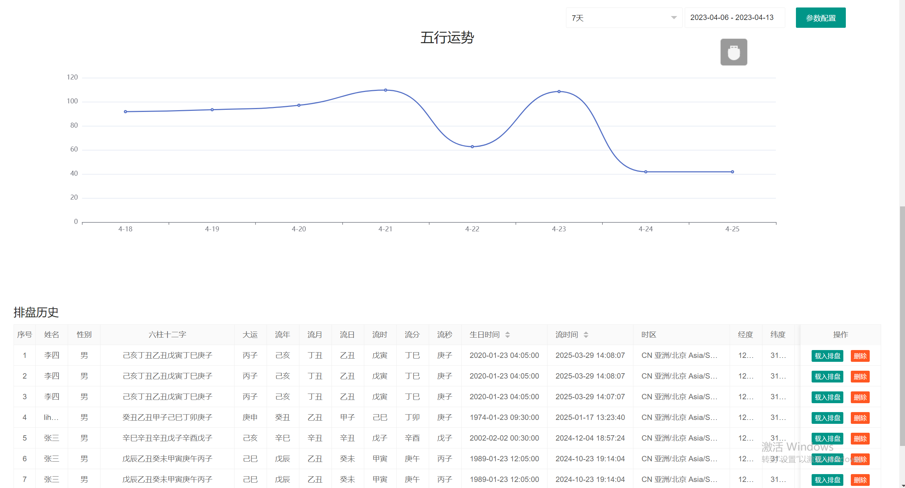
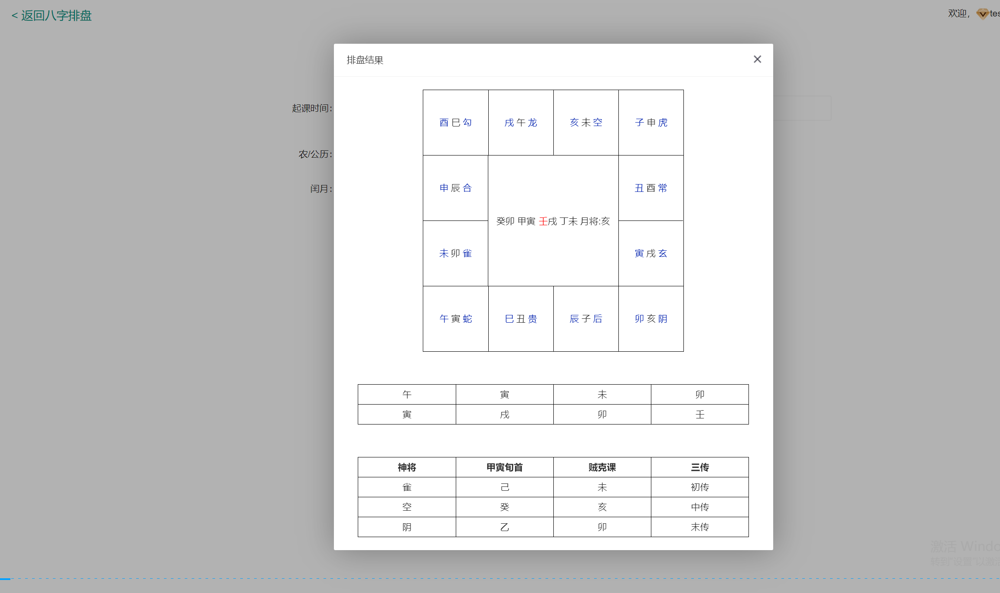
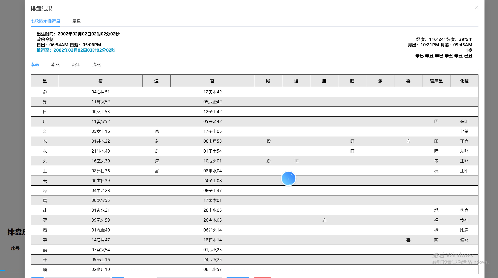

# 周易排盤｜易經排盤｜周易玄學綜合系統｜四柱八字｜紫微斗數｜七政四餘｜奇門遁甲｜大六壬

[簡體中文](README.md) | [English](README.en.md) | **繁體中文**

> **本系統整合八字、紫微斗數、奇門遁甲等多種傳統命理演算法，集七種核心玄學演算法於一體，支援網頁即時排盤。**

Chinese Fortune-Telling Platform | 命理系統  
Bazi + Ziwei + Qimen Dunjia | API Ready  
Chinese Metaphysics Platform | Bazi + Ziwei + Qimen Dunjia + Liu Ren  
Fortune-Telling System | Astrology Engine | Divination Platform

---

## 核心特色

本專案是一套整合八字、紫微斗數、奇門遁甲等多種傳統命理演算法的綜合計算系統，採用 Java 後端與網頁前端架構，旨在為相關研究與應用開發提供可擴充的實作。

| 模組 | 功能說明 |
| :--- | :--- |
| **四柱八字** | 陰陽五行、干支、排盤、運勢推算 |
| **紫微斗數** | 紫微運勢、星曜排盤、神煞分析 |
| **奇門遁甲** | 排盤、格局分析、吉凶判斷 |
| **七政四餘** | 古天文曆法、星曜運行推演 |
| **大六壬** | 六壬神課、占卜斷事 |
| **刑沖關係** | 地支刑沖合害、神煞解析 |

## 功能清單

八字排盤、紫微斗數排盤、奇門遁甲排盤、七政四餘排盤、大六壬占卜、神煞查詢、刑沖關係分析、運勢推算及網頁即時展示。

## 技術架構

- **後端：** Java（Spring 生態系）
- **前端：** HTML／JavaScript（可部署網頁）
- **部署：** 支援 Web 直接存取，並可封裝為 App

### 排盤計算引擎

- 天干地支計算邏輯
- 五行生剋關係推演
- 時間與曆法轉換（國曆／農曆）
- 命盤生成與結構解析

### 系統能力

- 模組化設計，容易擴充
- 支援多語言結構
- 可整合至 Web 或行動應用系統

## 程式碼結構

```text
├── UserService.java          # 使用者服務
├── PanRecordService.java     # 排盤記錄
├── MoiraTaskService.java     # 占卜任務
├── WuXingConfigService.java  # 五行設定
├── SmsRecordService.java     # 簡訊記錄
└── UserOrderService.java     # 訂單管理
```

Chinese Metaphysics Platform | 命理計算平台 | Bazi + Ziwei + Qimen Dunjia

## 專案定位

本專案是一套完整的中國傳統命理計算系統，包含：

- 八字（四柱）
- 紫微斗數
- 奇門遁甲
- 六壬

## 技術價值

- 基於時間的推算引擎
- 傳統命理演算法實作
- 多體系融合預測
- 模組化設計，方便功能擴充
- 可擴充的 API 支援
- 模組化架構設計

## 排盤介面實際截圖

  
**無極八字排盤介面**

  
**四柱八字排盤介面**

  
**五行分析介面**

  
**流年運勢分析**

  
**大六壬排盤介面**

  
**七政四餘排盤介面**

  
**七政四餘詳細排盤**

  
**綜合排盤總覽介面**

## 線上展示

本儲存庫包含一套可直接執行的網頁展示系統。

[啟動展示系統](./index.html)

> **說明：** 此展示僅用於介面與系統功能展示，不提供商業服務。

## 主要功能

- 四柱八字精準排盤，包含真太陽時、神煞、刑沖合害
- 紫微斗數完整排盤，包含十四主星、四化與宮位
- 奇門遁甲局數與格局判斷
- 七政四餘與大六壬排盤
- 多系統綜合運勢分析
- 網頁即時計算（低於 100 ms）

## 系統架構

- 後端：Java + Spring Boot
- 前端：響應式網頁（HTML + JavaScript）
- 支援 Docker 部署
- 提供完整 API 介面

---

## 計算邏輯說明

系統依據傳統術數規則建模，實作以下核心計算能力：

- 干支紀年、紀月、紀日與紀時推算
- 五行（金、木、水、火、土）關係計算
- 命盤結構生成（宮位／星曜／局數）
- 時間驅動的排盤邏輯

適用於術數演算法研究與數位化實作。

---

## 使用情境

- 術數研究與教學
- 命理排盤工具開發
- 中國傳統文化數位化
- AI 輔助分析系統與擴充
- Web、App 等多種展示方式

---

## MasterAI 相關專案

- [MasterAI 專案主頁](https://github.com/masterai-top)
- [八字、紫微斗數與奇門遁甲綜合系統](https://github.com/masterai-top/Bazi-Ziwei-Qimen-Dunjia-Divination-System-Source-Code)
- [周易排盤系統](https://github.com/masterai-top/Zhouyi-Divination-System-Source-Code)

## 問題回報與交流

如果您在使用過程中遇到問題，或有技術改進建議，歡迎透過以下方式與我們聯絡：

- **Telegram：** @xuzongbin001
- **Email：** masterai918@gmail.com

---

感謝您的 Star 支持。歡迎為此儲存庫加上 Star，共同支持正統玄學文化的數位傳承。
